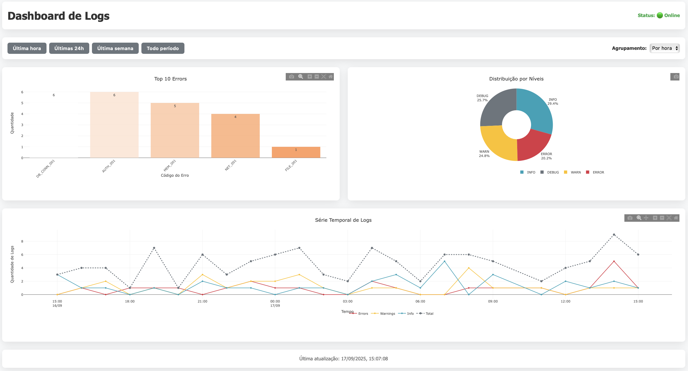
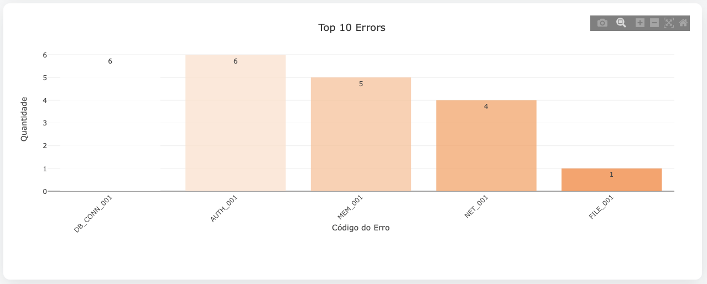
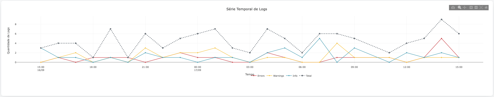
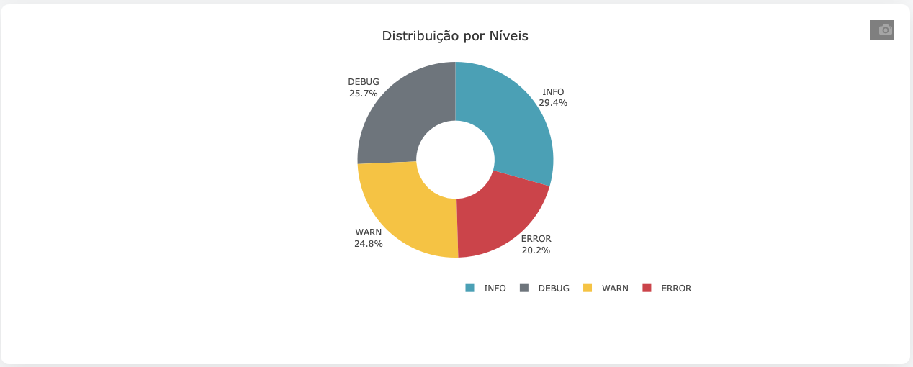

# Log Dashboard

Dashboard de logs com backend Node.js/Express e frontend React para visualização de estatísticas de logs.

## 🚀 Funcionalidades

- **Backend**: API REST com Node.js, Express e TypeScript
- **Frontend**: Dashboard React com gráficos Plotly
- **Banco**: MongoDB com TTL de 10 dias
- **SSH**: Fetch remoto de logs via SSH
- **Docker**: Containerização completa com Docker Compose

## 📋 Pré-requisitos

- Docker e Docker Compose
- Node.js 18+ (para desenvolvimento local)
- MongoDB (opcional para desenvolvimento local)

## 📸 Screenshots

> **💡 Screenshots do Dashboard em funcionamento**


*Dashboard principal com os três gráficos principais*


*Gráfico de barras dos erros mais frequentes*


*Série temporal com zoom e interatividade*


*Distribuição por níveis de log*

## 🛠️ Instalação

### 1. Clone o repositório
```bash
git clone <repository-url>
cd log-dashboard
```

### 2. Configure as variáveis de ambiente

**Backend** (`backend/env.example` → `backend/.env`):
```env
MONGO_URI=mongodb://mongo:27017/log-dashboard
PORT=3000
NODE_ENV=development
SSH_HOST=your-remote-server.com
SSH_USER=your-username
SSH_PORT=22
SSH_KEY_PATH=/path/to/your/private/key
SSH_TIMEOUT=15000
LOG_LEVEL=info
```

**⚠️ Importante para SSH**: Se o servidor SSH usar algoritmos legados (ssh-rsa), configure:
```bash
# Opção 1: Arquivo de configuração SSH
cp backend/ssh_config ~/.ssh/config

# Opção 2: Variáveis de ambiente
export SSH_OPTS="HostKeyAlgorithms=+ssh-rsa,PubkeyAcceptedAlgorithms=+ssh-rsa"
```

**Frontend** (`frontend/env.example` → `frontend/.env`):
```env
VITE_API_URL=http://localhost:3000
```

### 3. Execute com Docker Compose
```bash
cd docker
docker compose up -d
```

### 4. Teste rápido
```bash
# Verificar se tudo está funcionando
curl http://localhost:3000/health

# Popular com dados de exemplo
docker compose exec api npm run seed:logs

# Verificar dados no MongoDB
docker compose exec mongo mongosh log-dashboard --eval "db.logs.countDocuments()"
```

## 🏃‍♂️ Uso

### URLs de Acesso
- **Dashboard**: http://localhost:5173
- **API**: http://localhost:3000
- **MongoDB Express**: http://localhost:8081 (admin/admin123)

### Comandos Úteis

```bash
# Ver logs dos containers
docker compose logs -f

# Parar todos os serviços
docker compose down

# Rebuild das imagens
docker compose up -d --build

# Acessar MongoDB
docker compose exec mongo mongosh log-dashboard

# Executar scripts do backend
docker compose exec api npm run seed:logs
docker compose exec api npm run ingest

# Ver logs específicos
docker compose logs api
docker compose logs web
docker compose logs mongo

# Acessar container
docker compose exec api sh
docker compose exec mongo mongosh log-dashboard

# Executar testes
docker compose exec api npm test
```

## 🧪 Testes e Dados Fictícios

### 📋 Para Iniciantes - Passo a Passo Completo

**Objetivo**: Ver o dashboard funcionando com dados de exemplo em 5 minutos.

#### Passo 1: Verificar se o projeto está rodando
Abra o terminal e digite:
```bash
# Verificar se os containers estão rodando
docker compose ps
```
**O que você deve ver**: 3 containers (mongo, api, web) com status "Up"

#### Passo 2: Popular com dados fictícios
```bash
# Popular com ~1000 logs de exemplo
docker compose exec api npm run seed:logs
```
**O que você deve ver**: Mensagens como "Criando logs fictícios..." e "Logs criados com sucesso!"

#### Passo 3: Verificar se os dados foram criados
```bash
# Contar quantos logs foram criados
docker compose exec mongo mongosh log-dashboard --eval "db.logs.countDocuments()"
```
**O que você deve ver**: Um número como "1000" (aproximadamente)

#### Passo 4: Abrir o Dashboard no navegador
1. Abra seu navegador (Chrome, Firefox, Safari)
2. Digite na barra de endereços: `http://localhost:5173`
3. Pressione Enter

**O que você deve ver**: Uma página com 3 gráficos coloridos

#### Passo 5: Testar os gráficos
1. **Gráfico de Barras (Top Errors)**: Deve mostrar barras coloridas com nomes de erros
2. **Gráfico de Pizza (Levels Distribution)**: Deve mostrar um círculo dividido em fatias coloridas
3. **Gráfico de Linha (Time Series)**: Deve mostrar uma linha com pontos ao longo do tempo

#### Passo 6: Testar os filtros
1. Clique nos botões "Última Hora", "Último Dia", "Última Semana"
2. **O que deve acontecer**: Os gráficos devem atualizar automaticamente
3. No gráfico de linha, mude o seletor de "hour" para "day"
4. **O que deve acontecer**: A linha deve ficar mais suave

### 🎯 O que você deve ver no Dashboard

**Se tudo estiver funcionando, você verá:**

1. **Cabeçalho**: "Log Dashboard" com status "Sistema funcionando"
2. **Controles**: Botões de período e seletor de agrupamento
3. **3 Gráficos**:
   - **Top Errors**: Barras mostrando erros como "Database connection failed"
   - **Levels Distribution**: Pizza com fatias para "error", "warn", "info", "debug"
   - **Time Series**: Linha mostrando evolução dos logs ao longo do tempo

### 🔍 Verificando se os dados estão corretos

**Para ver uma amostra dos dados criados:**
```bash
# Ver 3 exemplos de logs criados
docker compose exec mongo mongosh log-dashboard --eval "db.logs.find().limit(3).pretty()"
```

**O que você deve ver**: 3 blocos de texto com informações como:
- `timestamp`: Data e hora
- `level`: "error", "warn", "info" ou "debug"
- `message`: Descrição do log
- `source`: "api-server" ou similar

### 🚨 Problemas Comuns para Iniciantes

#### "Não consigo ver os gráficos"
**Possíveis causas:**
1. **Dados não foram criados**: Execute novamente `docker compose exec api npm run seed:logs`
2. **API não está funcionando**: Verifique se `curl http://localhost:3000/health` retorna "OK"
3. **Navegador não carrega**: Tente `http://localhost:5173` em outro navegador

#### "Os gráficos estão vazios"
**Solução:**
```bash
# Verificar se há dados
docker compose exec mongo mongosh log-dashboard --eval "db.logs.countDocuments()"

# Se retornar 0, criar dados novamente
docker compose exec api npm run seed:logs
```

#### "Erro de conexão no navegador"
**Verificações:**
1. Os containers estão rodando? `docker compose ps`
2. A porta 5173 está livre? `lsof -i :5173`
3. Tente acessar: `http://127.0.0.1:5173`

### 📱 Testando em Diferentes Dispositivos

**Desktop/Notebook:**
- Acesse: `http://localhost:5173`
- Teste redimensionar a janela (os gráficos devem se adaptar)

**Mobile (mesmo WiFi):**
- Descubra seu IP: `ifconfig | grep inet`
- Acesse: `http://SEU_IP:5173`
- Exemplo: `http://192.168.1.100:5173`

### 🎨 Personalizando para Teste

**Quer ver dados diferentes?**
```bash
# Limpar dados atuais
docker compose exec mongo mongosh log-dashboard --eval "db.logs.deleteMany({})"

# Criar novos dados
docker compose exec api npm run seed:logs

# Recarregar a página no navegador (F5)
```

### Dados Fictícios Incluídos
O comando `seed:logs` cria:
- **~1000 logs** com diferentes níveis (error, warn, info, debug)
- **Período de 7 dias** com timestamps variados
- **Mensagens realistas** de erro e informações
- **Códigos de erro** diversos (DB_CONN_001, AUTH_002, etc.)
- **Contextos variados** com dados adicionais

### Limpando Dados de Teste
```bash
# Limpar todos os logs (cuidado!)
docker compose exec mongo mongosh log-dashboard --eval "db.logs.deleteMany({})"

# Verificar se foi limpo
docker compose exec mongo mongosh log-dashboard --eval "db.logs.countDocuments()"
```

### Testando Ingestão de Logs
```bash
# Testar ingestão de logs locais
docker compose exec api npm run ingest

# Verificar logs de ingestão
docker compose logs api | grep "ingest"
```

### Testando Conexão SSH
```bash
# Testar conexão SSH (se configurado)
docker compose exec api npm run test:ssh

# Ver logs de conexão SSH
docker compose logs api | grep "ssh"
```

### Verificando Health Checks
```bash
# Health check da API
curl http://localhost:3000/health

# Health check do MongoDB
docker compose exec mongo mongosh --eval "db.adminCommand('ping')"

# Verificar status dos containers
docker compose ps
```

### Testando Endpoints da API
```bash
# Testar endpoint de top errors
curl "http://localhost:3000/stats/top-errors?limit=5"

# Testar time series (últimas 24h)
curl "http://localhost:3000/stats/time-series?bucket=hour&from=2024-01-01&to=2024-01-02"

# Testar distribuição por níveis
curl "http://localhost:3000/stats/levels?from=2024-01-01&to=2024-01-02"

# Testar com parâmetros específicos
curl "http://localhost:3000/stats/top-errors?from=2024-01-01&to=2024-01-31&limit=10"
```

### Exemplo de Dados Fictícios
Após executar `seed:logs`, você verá dados como:

```json
{
  "timestamp": "2024-01-15T10:30:00.000Z",
  "level": "error",
  "message": "Database connection failed",
  "source": "api-server",
  "errorCode": "DB_CONN_001",
  "context": {
    "retryCount": 3,
    "timeout": 5000
  }
}
```

### Workflow de Teste Completo
1. **Inicie o projeto**:
   ```bash
   cd docker
   docker compose up -d
   ```

2. **Popule com dados fictícios**:
   ```bash
   docker compose exec api npm run seed:logs
   ```

3. **Teste a API**:
   ```bash
   curl http://localhost:3000/health
   curl "http://localhost:3000/stats/top-errors?limit=5"
   ```

4. **Acesse o Dashboard**: http://localhost:5173

5. **Teste os gráficos**: Use os filtros e veja os dados sendo atualizados

## 📊 Endpoints da API

### Health Check
- `GET /health` - Status da aplicação

### Estatísticas
- `GET /stats/top-errors?from=&to=&limit=10` - Top erros
- `GET /stats/time-series?bucket=hour|day&from=&to=` - Série temporal
- `GET /stats/levels?from=&to=` - Distribuição por níveis

## 🧪 Desenvolvimento Local

### Backend
```bash
cd backend
npm install
npm run dev
```

### Frontend
```bash
cd frontend
npm install
npm run dev
```

## 📁 Estrutura do Projeto

```
log-dashboard/
├── backend/
│   ├── src/
│   │   ├── models/Log.ts          # Modelo MongoDB com TTL
│   │   ├── services/
│   │   │   ├── logIngest.ts       # Ingestão com validação Zod
│   │   │   └── sshFetch.ts        # Fetch remoto via SSH
│   │   ├── routes/stats.ts        # Endpoints da API
│   │   ├── lib/logger.ts          # Logger JSON (Pino)
│   │   └── index.ts               # Servidor Express
│   ├── Dockerfile
│   └── package.json
├── frontend/
│   ├── src/
│   │   ├── pages/Dashboard.tsx    # Página principal
│   │   ├── components/charts/     # Componentes de gráficos
│   │   ├── api/client.ts          # Cliente da API
│   │   └── hooks/useStats.ts      # Hooks SWR
│   ├── Dockerfile
│   └── package.json
├── docker/
│   ├── docker-compose.yml         # Orquestração
│   └── mongo-init/init.js         # Script de inicialização
└── reports/sql/                   # Queries SQL de exemplo
```

## 🔧 Configuração SSH

1. Gere uma chave SSH:
```bash
ssh-keygen -t rsa -b 4096 -f ~/.ssh/log-dashboard
```

2. Configure a chave no servidor remoto:
```bash
ssh-copy-id -i ~/.ssh/log-dashboard.pub user@remote-server
```

3. Defina permissões:
```bash
chmod 600 ~/.ssh/log-dashboard
```

4. Configure no `.env`:
```env
SSH_KEY_PATH=/home/user/.ssh/log-dashboard
```

## 📈 Gráficos Disponíveis

1. **Top Errors**: Gráfico de barras dos erros mais frequentes
2. **Levels Distribution**: Gráfico de pizza da distribuição por níveis
3. **Time Series**: Gráfico de linha com série temporal

## 📊 Estrutura dos Dados

### Formato de Log
```json
{
  "timestamp": "2024-01-15T10:30:00.000Z",
  "level": "error",
  "message": "Database connection failed",
  "source": "api-server",
  "errorCode": "DB_CONN_001",
  "context": {
    "retryCount": 3,
    "timeout": 5000
  }
}
```

### Níveis de Log
- `error`: Erros críticos
- `warn`: Avisos
- `info`: Informações
- `debug`: Debug

## 🔒 Segurança

- Nunca commite arquivos `.env` ou chaves SSH
- Use HTTPS em produção
- Configure firewall adequadamente
- Rotacione chaves SSH regularmente

## 🐛 Troubleshooting

### Containers não iniciam
```bash
# Verificar se as portas estão livres
lsof -i :3000
lsof -i :5173
lsof -i :27017

# Verificar logs de erro
docker compose logs
```

### MongoDB não conecta
```bash
docker compose logs mongo
docker compose exec mongo mongosh --eval "db.adminCommand('ping')"
```

### API não responde
```bash
# Verificar se MongoDB está rodando
docker compose exec mongo mongosh --eval "db.adminCommand('ping')"

# Verificar logs da API
docker compose logs api

# Testar health check
curl http://localhost:3000/health
```

### Frontend não carrega
```bash
# Verificar se API está acessível
curl http://localhost:3000/health

# Verificar logs do frontend
docker compose logs web

# Testar acesso direto
curl http://localhost:5173
```

### Problemas com SSH
```bash
# Testar conexão SSH
npm run test:ssh

# Verificar configuração SSH
cat ~/.ssh/config

# Testar com opções de compatibilidade
ssh -o HostKeyAlgorithms=+ssh-rsa -o PubkeyAcceptedAlgorithms=+ssh-rsa user@host
```

## 📝 Licença

Minha licença - Se tiver dúvidas, entre em contato.
